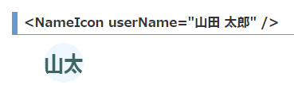

# 名前表示アイコン コンポーネント(React)

## はじめに

昔作った[TypeScriptで名前(文字)が入った丸いアイコン画像を作成する](https://qiita.com/murasuke/items/e41011d57d5d010e65e0)をReact(Suspense)でコンポーネント化しました。



* canvasを使い画像化しています。画像作成(`canvas.convertToBlob()`)は非同期関数のため、React18の`Suspense`を利用して表示しています。

## サンプル

https://murasuke.github.io/NameIcon/

## 概要

* 名前からアイコン画像を作成します(.png)。オプションで色やフォントを指定可能
  * スペースを含む場合、splitして最初の2文字を結合する '山田 太郎' -> '山太'。
  * スペースを含まない場合、先頭2文字にする '山田太郎' -> '山田'
* 生成した画像をSuspenseを利用して表示します

## 利用方法

* 表示したい名前を渡すとアイコンが表示されます

```typescript
<>
  <NameIcon userName="山田 太郎" />
  <NameIcon userName="山田太郎" />
  <NameIcon userName="Mike Davis" />
</>
```
   

* サイズを指定
```typescript
<>
  <NameIcon userName="山田 太郎" option={{ size: 20 }} />
  <NameIcon userName="山田 太郎" option={{ size: 80 }} />
</>
```
 

* 色、フォントを指定
```typescript
<>
  <NameIcon userName="山田太郎" option={{ foreColor: '#69C', backColor: '#FFF2F3' }} />
  <NameIcon userName="山田 太郎" option={{ fontFamily: 'serif' }} />
</>
```
 

* スケール(画像に対する文字の大きさ)を指定
```typescript
<>
  <NameIcon userName="山田 太郎" option={{ fontScale: 0.3 }} />
  <NameIcon userName="山田 太郎" option={{ fontScale: 1.0 }} />
</>
```
 


### ソース全体

* 画像コンポーネント(canvasで非同期に生成した画像をSuspenseで表示する)

NameIcon.tsx
```typescript
import { FC, Suspense } from 'react';
import iconMaker, { IconOption } from './iconMaker';

/**
 * Suspenceを使い、Canvasで生成した画像を表示するコンポーネント
 * canvas.convertToBlob()が非同期関数のため、描画した画像をそのまま埋め込むことができない
 */

type IconMakerFC = FC<{ userName: string; option?: IconOption }>;

const iconImage: { [key: string]: string } = {};
const IconMaker: IconMakerFC = ({ userName, option }) => {
  const iconMakerWrapper = () => {
    if (!iconImage[userName]) {
      throw iconMaker(userName, option).then((r) => (iconImage[userName] = r));
    } else {
      return iconImage[userName];
    }
  };

  return ;
};

const NameIcon: IconMakerFC = ({ userName, option }) => (
  <Suspense fallback={<p>Loading...</p>}>
    <IconMaker userName={userName} option={option} />
  </Suspense>
);

expor default NameIcon;
```


* 画像作成本体(canvasに名前を描画して画像化)

iconMaker.ts
```typescript
/**
 * 名前アイコン作成
 * ・スペースで区切った先頭2文字で丸アイコンを作成する
 * ・「日本 太郎」=>「日太」
 * ・「Mike Davis」=>「MD」
 */

// Icon作成オプション
export type IconOption = {
  size?: number; // iconのサイズ
  foreColor?: string; // フォントの色
  backColor?: string; // 背景色
  fontScale?: number; // フォントのサイズ(iconのサイズに対する比率(0.7程度が適当))
  fontFamily?: string; // フォントの種類
};

// Icon作成デフォルト値
const defaultValue: IconOption = {
  size: 50,
  foreColor: '#3c665f',
  backColor: 'aliceblue',
  fontScale: 0.6,
  fontFamily: 'sans-serif',
};

/**
 * アイコン用画像作成
 * @param name アイコンにする名前
 * @param option IconOption
 * @returns
 */
const iconMaker = async (
  name: string,
  option?: IconOption
): Promise<string> => {
  // デフォルト値をoptionのプロパティーで(あれば)上書き
  const opt = { ...defaultValue, ...option };
  const [width, height] = [opt.size, opt.size];

  // 描画用のCanvasを用意する
  const canvas = new OffscreenCanvas(width, height);
  const context = canvas.getContext('2d');
  if (!context) throw new Error('could not get context.');

  // スペースを含む場合、splitして最初の2文字を結合する '山田 太郎' -> '山太'。
  // スペースを含まない場合、先頭2文字にする '山田太郎' -> '山田'
  const splitName = name.split(' ');
  const abbrev =
    splitName.length >= 2
      ? splitName[0].substring(0, 1) + splitName[1].substring(0, 1)
      : name.substring(0, 2);

  // canvasを円形にくり抜く(clip)
  context.beginPath();
  context.ellipse(
    width / 2,
    height / 2,
    width / 2,
    height / 2,
    0,
    0,
    Math.PI * 2
  );
  context.closePath();
  context.clip();

  // 背景を塗りつぶす
  context.fillStyle = opt.backColor;
  context.fillRect(0, 0, width * 2, height * 2);

  // 名前を描画
  context.fillStyle = opt.foreColor;
  context.font = `bold ${height * opt.fontScale}px ${opt.fontFamily}`;

  // 文字の中心を合わせる
  const mesure = context.measureText(abbrev);
  const centerX = width - mesure.width > 0 ? (width - mesure.width) / 2 : 0;
  const centerY =
    (height +
      mesure.actualBoundingBoxAscent +
      mesure.actualBoundingBoxDescent) /
    2;
  context.fillText(abbrev, centerX, centerY, width);

  // Canvasの画像をオブジェクトURLへ変換(imgタグのhrefにセットすると画像を表示できる)
  const blob = await canvas.convertToBlob();
  const imageUrl = URL.createObjectURL(blob);

  return imageUrl;
};

export default iconMaker;
```
